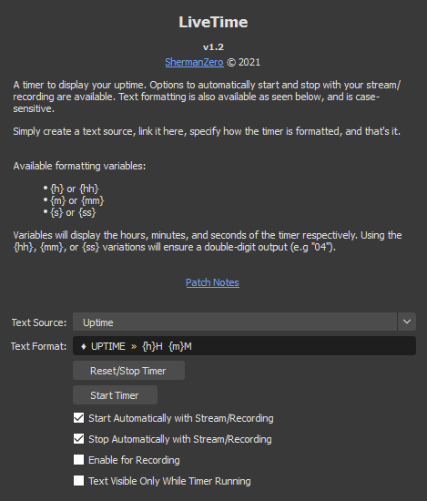

# LiveTime
An OBS Python script allowing you to display your uptime in a text source.

### Installation
Download this repo as a .zip, extract, and move livetime.py into your OBS scripts directory.  This is a python file, so you will need to have the latest OBS-supported version of [Python](https://www.python.org/downloads/release/python-368/) installed.  Point OBS to the Python installation directory via the Python Settings tab in the Scripts window.  Add livetime.py as a script.  Enjoy!

